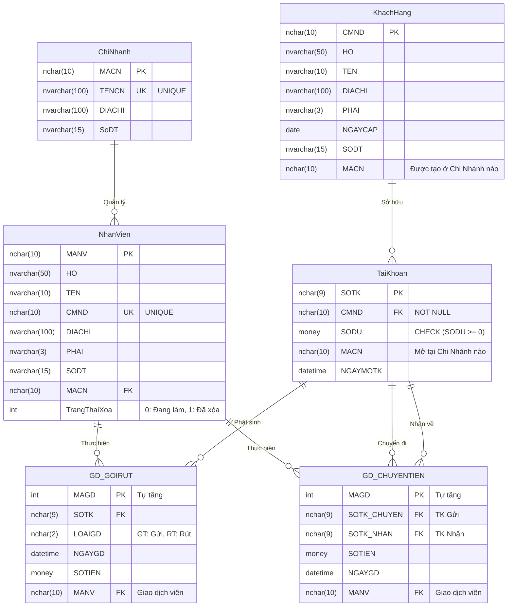

# 📊 Sơ Đồ Thực Thể Liên Kết (ERD) - Database NGANHANG

Tài liệu này cung cấp cái nhìn tổng quan về kiến trúc Database dưới dạng sơ đồ thực thể liên kết (ER Diagram). Sơ đồ này mô tả chi tiết các bảng, các trường dữ liệu quan trọng, khóa chính (PK), khóa ngoại (FK), các ràng buộc (UK - Unique, NOT NULL, CHECK), và mối quan hệ giữa chúng.

## 📝 Chú thích các chuẩn thiết kế

*   **Bảng `ChiNhanh` và `NhanVien`**: Được liên kết qua `MACN`. Tại một phân mảnh cụ thể, bảng `NhanVien` chỉ chứa nhân viên làm việc tại `MACN` đó. Các trường `TENCN` và `CMND` có ràng buộc duy nhất (UNIQUE).
*   **Bảng `KhachHang` và `TaiKhoan`**: Một khách hàng (PK: `CMND`) có thể có nhiều Tài khoản. Tài khoản bắt buộc phải có chủ sở hữu (`CMND` là NOT NULL) và số dư luôn luôn phải không âm (`CHECK (SODU >= 0)`).
*   **Các bảng Giao Dịch (`GD_GOIRUT`, `GD_CHUYENTIEN`)**: Không có cột `MACN`. Nguyên tắc thiết kế CSDL Phân Tán yêu cầu dữ liệu giao dịch phải "đi theo" nhân viên hoặc tài khoản phát sinh ra nó thay vì bị cố định dư thừa. Mối quan hệ được truy vết hoàn toàn qua `SOTK` và `MANV`.
*   **Tính ACID trong Chuyển Tiền**: Khi thực hiện `GD_CHUYENTIEN` giữa hai tài khoản thuộc hai chi nhánh khác nhau, `SOTK_CHUYEN` (của chi nhánh gốc) và `SOTK_NHAN` (của chi nhánh đích) sẽ được bọc trong một Distributed Transaction (MSDTC) thay vì được liên kết cứng vật lý (Foreign Key constraints liên chi nhánh), nhằm bảo toàn khả năng vận hành độc lập của các Site.
